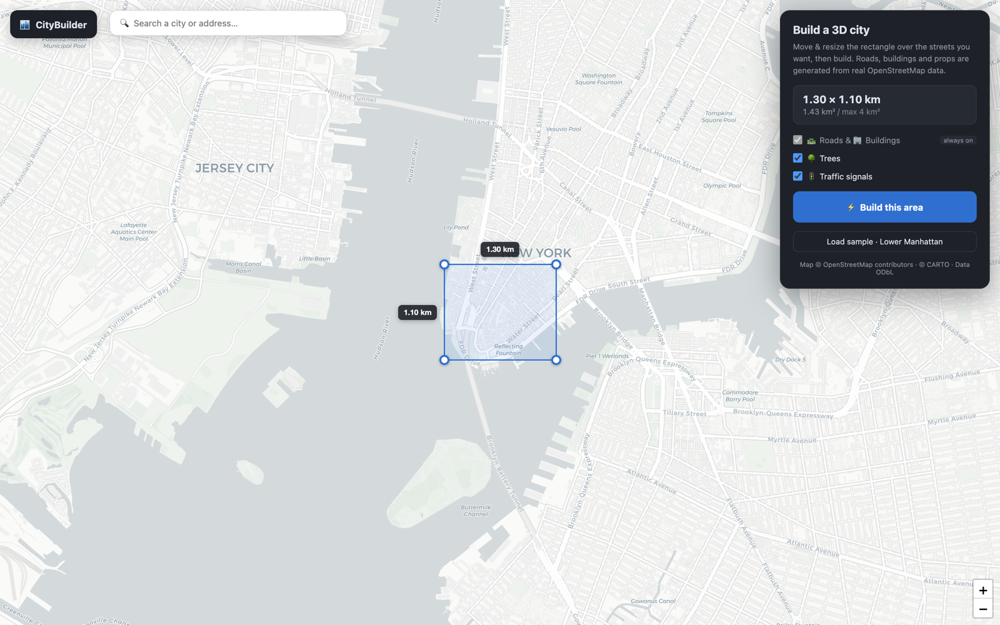
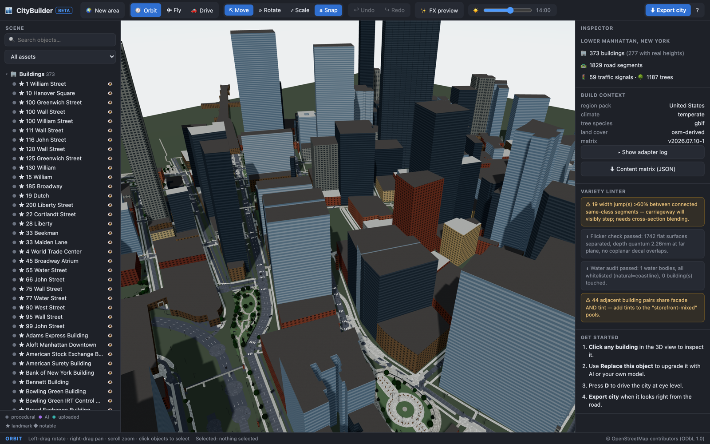
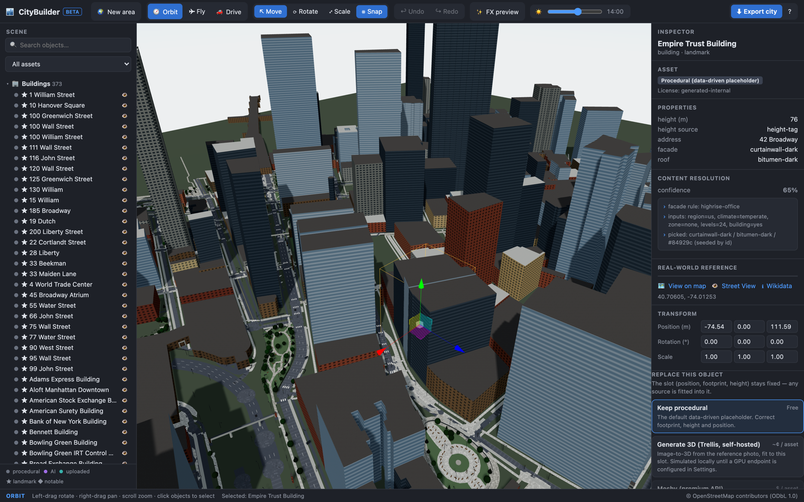
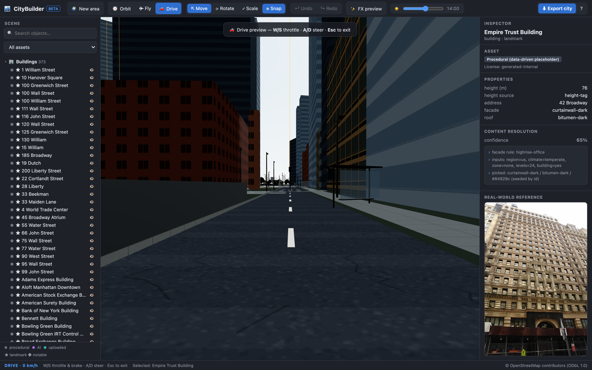
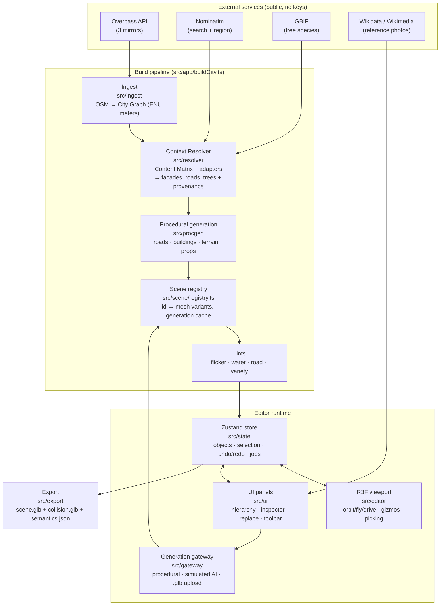
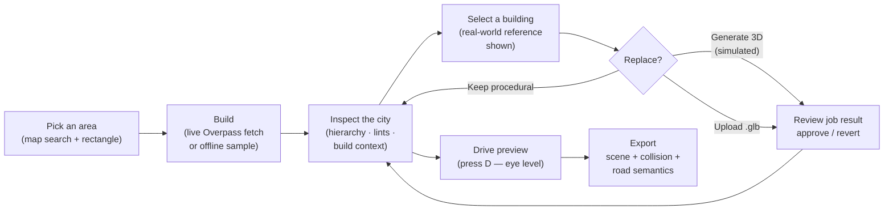
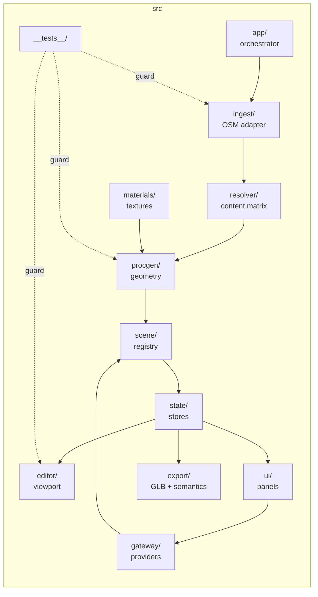

# CityBuilder

**Turn real map data into an editable, game-ready 3D city — in the browser.**

CityBuilder ingests OpenStreetMap data for any area in the world and deterministically builds a fully separated, semantically tagged 3D scene: roads with lane markings and sidewalks, extruded buildings with data-driven facades, traffic signals, street trees, and props. Every object is individually selectable and carries provenance. Buildings can be upgraded one click at a time — kept procedural, replaced with a generated model, or swapped for an uploaded `.glb` — and the whole scene exports as visual geometry, a collision layer, and machine-readable road semantics for game engines.

Everything runs client-side. **No backend, no API keys, no configuration** — clone, install, run.


*The area picker: search a place, drag/resize the selection rectangle (max 4 km²), toggle data layers, and build. A bundled Lower Manhattan sample works fully offline.*

---

## Vision

> This section describes where the project is headed. Items here are **not yet implemented** unless also listed under "Current features."

CityBuilder is evolving into an **Asset Management Platform for building realistic, game-ready cities**. Today it uses OpenStreetMap as the foundation for creating and editing real-world map data. Over time it will grow into:

- **A central Asset Library** — import, organize, tag, search, and reuse assets across projects.
- **Blender integration** — round-trip assets between CityBuilder and DCC tools.
- **AI-powered asset generation** — real image-to-3D providers (the generation pipeline, job queue, caching, and review flow already exist; the GPU backends are pending).
- **Expanded procedural generation tools** — richer, controllable generators beyond the current road/building/prop systems.
- **An import/export asset pipeline** — structured formats for moving city data in and out of engines and toolchains.

The long-term goal: become the **single source of structured city data that AI agents can use to automatically generate high-quality, realistic game worlds** — roads, buildings, props, vegetation, metadata, and other assets included.

---

## Features

### Current (implemented and working)

| Area | What you get |
|---|---|
| **Pick any city** | Full-screen Leaflet map (CARTO basemap), Nominatim place search, draggable/resizable selection rectangle with live km labels and a 4 km² cap, per-layer toggles. Live Overpass fetch with three-mirror fallback; last city cached in `localStorage`; bundled offline sample of Lower Manhattan (373 buildings — 277 with real heights, ~1,800 road segments, 59 signals, 1,187 trees). |
| **OSM → City Graph** | `ingestOverpass` normalizes raw OSM into an internal City Graph in a local ENU meter frame. Water is **whitelist-only** (coastline seas are stitched and clipped; fountains/pools/streams become props or are dropped), building heights resolve from tags → levels → estimate, and buildings are tiered landmark / notable / generic. |
| **Context resolver** | A declarative **Content Matrix** (region packs, facade rules, road rules, climate tree pools, zone props) is combined with live adapters — Nominatim region, climate heuristic, GBIF tree species — each with graceful fallback. Every resolution records confidence and a provenance trail visible in the Inspector. |
| **Procedural generation** | Deterministic (seeded per feature id): smoothed road centerlines with carriageways, raised sidewalks and curbs, region-correct lane markings, crosswalks, intersection surfaces, bridges and tunnel portals, wear decals with a non-overlap planner; extruded buildings with procedural PBR facade textures; instanced multi-species trees; zoning-aware street furniture. |
| **Editor** | Orbit / fly / **drive** cameras (press `D` for eye-level validation at ~1.5 m), click and shift-click selection, move/rotate/scale gizmos with snapping, searchable hierarchy grouped by type with provenance dots and visibility toggles, inspector with numeric transforms, full command-based undo/redo, sun/time-of-day slider, FX preview. Roads are locked — never editable or replaceable. |
| **Click-to-replace** | Select a building → see its real-world reference (Wikidata photo, Google Maps + Street View links) → choose a provider. *Keep procedural* is always free; *Generate 3D* runs an async job with progress, slot-hash caching, and an approve/revert review flow (**simulated locally** — see below); *Upload .glb* is real: parsed, auto-scaled, grounded, and fitted into the slot. |
| **Quality gates** | Automatic lints after every build: road-consistency, flicker/depth-precision invariants, a water audit, and a variety linter (repeated facade/tint detection) — results shown in the Inspector and re-checked at export. |
| **Export** | One click downloads `city_scene.glb` (visual), `city_collision.glb` (roads/ground as-is + building bounding boxes), `city_semantics.json` (road centerlines, widths, lanes, one-way flags, per-object provenance and license), and a texture manifest — the data a game's traffic AI consumes. |


*The editor after building the Lower Manhattan sample: searchable hierarchy (left), procedural city with roads, parks, and tiered buildings (center), city report with build context, adapter provenance, and variety-linter findings (right).*

### Simulated or stubbed (code paths exist, backends pending)

- **AI generation (`Generate 3D`)** — the job queue, progress UI, slot-hash caching, and approve/revert flow are fully implemented, but the worker is a local simulation that produces an enhanced procedural variant. Wiring a real GPU endpoint replaces one function (`runGeneration()` in [src/gateway/providers.ts](src/gateway/providers.ts)).
- **Meshy / Sketchfab providers** — entries exist in the provider menu, disabled until API keys/integration are added.
- **CLIP-based visual matching** and **ESA WorldCover rasters** — declared adapters; land cover is currently OSM-derived.

### Planned (vision — not yet started)

- Central asset library with tagging, search, and cross-project reuse
- Blender integration
- Import/export asset pipeline beyond the current GLB/JSON export
- Tiling/LOD streaming for whole-city scale, terrain elevation (DEM), richer props
- Structured city-data API for AI agents to consume

---

## Screenshots

| | |
|---|---|
|  *Pick any area in the world* |  *Procedural city + quality lints* |
|  *Select a building → content resolution trail, real-world reference, provider menu* |  *Drive preview: eye-level validation with lane markings and street lighting* |

---

## Tech stack

| Layer | Technology |
|---|---|
| Language | TypeScript 5.6 (strict) |
| UI | React 18 |
| 3D | Three.js 0.169 via React Three Fiber 8, drei, postprocessing |
| 2D map | Leaflet 1.9 (CARTO basemap) |
| State | Zustand 4 (command-based undo/redo; Three objects live outside React in a registry) |
| Build | Vite 5 |
| Tests | Vitest 2 |
| Data | OpenStreetMap via Overpass API (3-mirror fallback), Nominatim, GBIF, Wikidata/Wikimedia |

---

## Architecture

The build is a one-way deterministic pipeline; the editor then operates on the resulting scene through a central store and object registry.



**Key design decisions (as found in the code):**

- **City Graph as source of truth** — ingest adapters normalize any provider (Overpass today; the adapter contract allows others) into one schema in a local meter frame ([src/types.ts](src/types.ts)).
- **Determinism everywhere** — every procedural choice is seeded by feature id (`hash01`), so the same area always builds the same city and identical footprints share one generated asset.
- **Whitelist-only water** — only explicitly whitelisted OSM water features render as water; coastline seas are assembled to flood as few buildings as possible, and a water audit runs on every build ([src/resolver/waterAudit.ts](src/resolver/waterAudit.ts)).
- **Depth-precision discipline** — a logarithmic depth buffer plus a documented layer-height convention ([src/editor/depthConfig.ts](src/editor/depthConfig.ts)) keeps coplanar surfaces (road → markings → decals) flicker-free, enforced by tests.
- **Replace-in-slot** — a building's slot (position, footprint, height) is fixed; any provider result — generated or uploaded — is scaled, grounded, and fitted into it, with approve/revert.
- **Roads are locked** — driving-grade road geometry is never part of the edit/replace flow.

### User workflow




*The heart of the app: a selected building shows how its look was resolved (rule, inputs, confidence), links to its real-world reference, and offers the provider menu — keep procedural, generate, or upload.*

---

## Installation & development

Requires Node.js (18+ recommended) and npm.

```bash
git clone https://git.rtracer.com/rtracer-members/citybuilder.git
cd citybuilder
npm install
npm run dev        # → http://localhost:5173
```

No API keys or configuration needed. Click **Load sample · Lower Manhattan** to build fully offline, or search any city and **Build this area** (live Overpass fetch).

| Script | What it does |
|---|---|
| `npm run dev` | Vite dev server on port 5173 |
| `npm run build` | Type-check (`tsc`) + production build |
| `npm run preview` | Serve the production build |
| `npm test` | Run the Vitest suites |

### Tests

Three suites guard the invariants that are easiest to silently break:

- **`waterClassification`** — whitelist-only water: lakes/rivers/seas render, fountains/pools/ditches never do; sea assembly refuses to flood buildings; the bundled sample passes its water audit.
- **`terrainCarve`** — water is carved as real holes in the ground plane (no z-fighting ground faces beneath), sunk to the configured depth.
- **`flickerInvariants`** — the log depth buffer and layer-separation convention actually prevent flicker at the far plane; the decal planner never overlaps.

> Run `npm test` before touching anything in `src/ingest`, `src/procgen/areas.ts`, or `src/editor/depthConfig.ts`.

---

## Folder structure

```
citybuilder/
├── index.html                 # entry point
├── public/
│   └── data/raw_osm.json      # bundled Lower Manhattan sample (real Overpass export)
├── docs/
│   ├── screenshots/           # README screenshots
│   └── water-and-flicker-rca.md
├── src/
│   ├── app/buildCity.ts       # build orchestrator (area / sample / cache → scene)
│   ├── ingest/                # Overpass fetch (mirrors, cache) + OSM → City Graph adapter
│   ├── resolver/              # Content Matrix, context adapters, per-feature resolution, lints
│   ├── procgen/               # deterministic geometry: roads, buildings, terrain, props, decals
│   ├── materials/             # procedural PBR texture generation + material library + packaging
│   ├── scene/registry.ts      # object id → mesh variants, generation cache, city graph
│   ├── state/                 # zustand stores: editor (undo/redo, jobs), drive HUD
│   ├── gateway/providers.ts   # provider menu: procedural / simulated AI / .glb upload / stubs
│   ├── editor/                # R3F viewport, cameras (orbit/fly/drive), gizmos, depth config
│   ├── ui/                    # AreaPicker, Toolbar, Hierarchy, Inspector, ReplacePanel, …
│   ├── export/exporter.ts     # GLB + collision + semantics + texture manifest export
│   ├── __tests__/             # water, terrain-carve, flicker invariant suites
│   └── types.ts               # City Graph schema
├── citybuilder-prd.md         # full product spec
└── package.json
```



---

## Environment variables

**None.** The app uses no `import.meta.env` / `process.env` values and requires no `.env` file. All external services (Overpass, Nominatim, GBIF, Wikidata, CARTO tiles) are public, keyless endpoints.

**Planned configuration** *(not yet implemented — today these are code-level switches in [src/gateway/providers.ts](src/gateway/providers.ts))*:

| Future setting | Purpose |
|---|---|
| Trellis GPU endpoint URL | Replace the simulated generation worker with a real image-to-3D service |
| Meshy API key | Enable the premium Meshy generation provider |
| Sketchfab OAuth token | Enable in-panel Sketchfab library search + download |

---

## Contributing

> No formal contribution process is set up yet (no CI, linting config, or issue templates — *to be documented*). Until then:

1. **Branch** from `main`, keep changes focused.
2. **Run `npm test`** before and after your change — especially if you touch ingest, terrain/areas, or depth configuration; the suites encode hard-won invariants (see [docs/water-and-flicker-rca.md](docs/water-and-flicker-rca.md) for why).
3. **Type-check** with `npm run build`.
4. **Preserve determinism** — procedural choices must be seeded by feature id, never by wall-clock time or unseeded randomness.
5. **Respect licensing** — map data is © OpenStreetMap contributors (ODbL 1.0); attribution is shown in-app and stamped into exports. Keep it that way.

---

## Future roadmap

Ordered roughly by proximity; everything here is **planned, not implemented**.

| Horizon | Item | Notes |
|---|---|---|
| Near | Real AI generation | Wire a Trellis GPU endpoint into the existing job/cache/review flow |
| Near | Meshy + Sketchfab providers | API integrations behind the existing provider menu |
| Mid | Tiling / LOD streaming | Whole-city scale (current slices render fully; PRD targets 3D Tiles) |
| Mid | Terrain elevation (DEM), bridges/tunnels rendering polish, selectable trees | Known MVP limits |
| Mid | Asset Library | Import, organize, tag, search, and reuse assets across projects |
| Mid | Import/export pipeline | Structured asset formats beyond GLB + semantics JSON |
| Far | Blender integration | Round-trip city assets with DCC tooling |
| Far | Procedural generation toolkit | Controllable generators exposed as authoring tools |
| Far | City data platform for AI agents | The single structured source AI agents query to generate realistic game worlds — roads, buildings, props, vegetation, and metadata |

---

## License & attribution

Map data **© OpenStreetMap contributors, ODbL 1.0** — attribution is displayed in-app and embedded in every export. Basemap tiles © CARTO. Tree species data via GBIF; building reference photos via Wikidata/Wikimedia Commons.

*No project license file is present yet (to be documented).*
